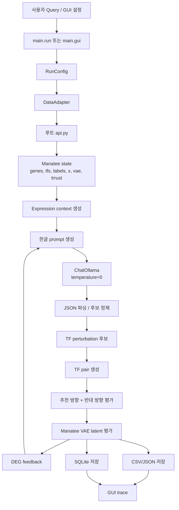

# Manatee LLM-Agent Refactor

이 저장소는 기존 `base.py`와 `api.py`의 Manatee perturbation workflow를 참고해 `main/` 아래에 새로 정리한 실행 코드입니다.

새 구현은 기존 데이터와 Manatee 모델 로딩 방식을 바꾸지 않습니다. 루트의 `api.py`를 import해서 `genes`, `tfs`, `labels`, `x`, `vae`, `trrust`를 그대로 사용합니다.

## 주요 기능

- LLM이 TF perturbation 후보를 생성합니다.
- Manatee가 후보 TF pair의 추천 방향과 반대 방향을 모두 평가합니다.
- 반복마다 best perturbation의 DEG feedback을 다음 LLM prompt에 넣습니다.
- 결과를 CSV/JSON과 SQLite에 동시에 저장합니다.
- GUI에서 run summary, raw LLM output, candidate TF, TF pair, evaluated strategy trace를 조회할 수 있습니다.

## 폴더 구조

```text
main/
  run.py                  CLI 실행 entrypoint
  gui.py                  Gradio GUI entrypoint
  config.py               stage, model, 반복 수, 후보 수, 결과 경로 설정
  agent/
    prompts.py            한글 LLM prompt
    llm.py                ChatOllama 호출, JSON 파싱, 후보 정제
    perturbation.py       context 생성, perturbation 평가, DEG 계산
    runner.py             전체 workflow 실행
  fixed/
    data_adapter.py       루트 api.py에서 Manatee state 로드
    store.py              SQLite 저장소
  app/
    app.py                GUI 화면과 trace 조회
```

## 필요 패키지

```bash
pip install -r requirements.txt
```

Ollama 기반 LLM을 쓰므로 실행 서버에 Ollama와 사용할 모델이 준비되어 있어야 합니다.

예:

```bash
ollama pull qwen2.5:14b
```

## 필요 파일

이 리팩토링 코드는 단독 프로젝트가 아니라 기존 Manatee 실행 루트에 얹어서 실행하는 구조입니다.

필수:

```text
api.py
app_state.py
Manatee 모델/데이터 파일들
trrust_mouse.txt 또는 app_state.py가 로드하는 TRRUST 데이터
main/
requirements.txt
```

`api.py`는 다음 변수를 제공해야 합니다.

```python
genes
tfs
labels
x
vae
trrust
```

기존 exhaustive rank 비교 CSV가 있으면 자동으로 읽습니다. 없으면 `NOT_AVAILABLE`로 기록하고 workflow는 계속 진행합니다.

기본 위치:

```text
results/manatee_e525_to_e625_all_2tf_parallel/all_2tf_combinations_ranked.csv
```

## CLI 실행

기본 실행:

```bash
cd /path/to/manatee-root
python -m main.run
```

먼저 import 진단을 돌리면 `api.py`, `app_state.py`, `Manatee/` 경로와 패키지 누락을 확인할 수 있습니다.

```bash
python -m main.diagnose
```

서버 구조가 `api.py`와 `Manatee/` 데이터 폴더를 다른 위치에 둔다면 경로를 명시하세요.

예를 들어 `tree.txt` 기준으로 `api.py`는 `temp/`, `Manatee/`는 `temp/main/` 아래에 있으면:

```bash
cd /path/to/temp
MANATEE_API_ROOT=/path/to/temp \
MANATEE_DATA_ROOT=/path/to/temp/main \
python -m main.diagnose
```

진단이 통과하면 workflow를 실행합니다.

```bash
MANATEE_API_ROOT=/path/to/temp \
MANATEE_DATA_ROOT=/path/to/temp/main \
python -m main.run --model qwen2.5:14b --n-iter 1 --n-candidates 10
```

짧은 smoke test:

```bash
python -m main.run --model qwen2.5:14b --n-iter 1 --n-candidates 10
```

stage 변경:

```bash
python -m main.run --source-stage E5.25 --target-stage E6.25
```

여러 모델 실행:

```bash
python -m main.run --model qwen2.5:14b --model gemma3:12b
```

최종 한글 리포트까지 생성:

```bash
python -m main.run --model qwen2.5:14b --final-answer
```

## GUI 실행

서버에서 GUI 실행:

```bash
cd /path/to/manatee-root
python -m main.gui --host 127.0.0.1 --port 7860
```

`api.py`와 `Manatee/` 위치가 다르면 GUI도 같은 환경변수를 붙여 실행합니다.

```bash
cd /path/to/temp
MANATEE_API_ROOT=/path/to/temp \
MANATEE_DATA_ROOT=/path/to/temp/main \
python -m main.gui --host 127.0.0.1 --port 7860
```

SSH 터널:

```bash
ssh -L 7860:127.0.0.1:7860 user@server
```

브라우저:

```text
http://127.0.0.1:7860
```

외부 접속을 직접 열어야 하면:

```bash
python -m main.gui --host 0.0.0.0 --port 7860
```

## 결과 파일

새 run은 아래에 생성됩니다.

```text
results/main_refactor/E525_to_E625/run_YYYYMMDD_HHMMSS/
```

주요 산출물:

```text
manatee_run.sqlite3
iterative_summary.csv
raw_llm_outputs.json
iteration_history.json
expression_context_tf_table.csv
{model}_iter{n}_screening_with_opposite.csv
{model}_iter{n}_perturbed_vs_original_deg.csv
final_answer.json
```

GUI trace의 `screening_overview`에서 확인할 수 있는 항목:

```text
candidate_tf_count
candidate_tfs
candidate_perturbations
unique_tf_pair_count
unique_tf_pairs
evaluated_strategy_count
strategy_count_formula
top_50_evaluated_strategies
```

## 주요 설정

기본값은 `main/config.py`에 있습니다.

```text
source_stage: E5.25
target_stage: E6.25
n_iter: 3
n_llm_candidates: 30
models: qwen2.5:14b
temperature: 0
compute_mmd: false
```

후보 수:

```text
최소: 2
기본: 30
최대: 60
```

전략 평가 수:

```text
평가 전략 수 = 후보 TF 수 C 2 * 4
```

예:

```text
30개 후보: 30C2 * 4 = 1,740
60개 후보: 60C2 * 4 = 7,080
```

속도를 우선하면 단일 모델과 작은 후보 수로 먼저 확인하세요.

```bash
python -m main.run --model qwen2.5:14b --n-iter 1 --n-candidates 10
```

MMD는 pair마다 큰 거리 행렬을 계산해서 느릴 수 있으므로 기본값은 꺼져 있습니다. 필요할 때만 켭니다.

```bash
python -m main.run --model qwen2.5:14b --n-iter 1 --n-candidates 10 --compute-mmd
```

## 구조



## 주의사항

- 기존 CSV를 자동으로 SQLite로 가져오는 마이그레이션 도구는 아직 없습니다.
- 새 workflow 실행 결과만 SQLite와 CSV/JSON에 동시에 저장됩니다.
- `main/`만 따로 실행하지 말고, 기존 `api.py`와 데이터/모델이 있는 루트에서 실행하세요.
- 서버 Python 환경에 `langchain-ollama`, `scipy`, `torch`, `gradio`가 있어야 전체 workflow와 GUI가 동작합니다.
